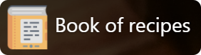

<a href="/"></a>
## Table of contents
* [General info](#general-info)
* [Installation](#installation)
* [Links](#links)

## General info
### • Introduction
Our project is to improve the security and protection of users' data on a website called "Book of Recipe". Our goal is to create a website that would be like a helpful "culinary book". The idea of our website is that users can browse recipes, add new ones and set their favorite recipes.
The main goal of this project is to secure users login credentials. The website is devoted to recipes, where every user of site can add their posts. The flask framework and the jinja template engine were used to secure the data. In addition, each user password is hashed. In this case, no third party can see the original password.
## Installation

### • Required software:
1. Python
2. Visual Studio Code
3. VSC plugins - Python and Pylance

### • Vs Code installation of packages:
Open a command-line.
```
cd ../BookOfRecipe
pip install flask
// then create a file where you will store the libraries
pip install -r requirements.txt

// opctional virtual environment
python -m venv venv
venv\Scripts\activate
```
You will need to generate a database to log in.
```
cd ../BookOfRecipe
python db_generator.py 
```
## Links
[Bootstrap v4.6.1](https://getbootstrap.com/docs/4.6/getting-started/introduction/)
<br>
[Flask documentation](https://flask.palletsprojects.com/en/2.1.x/)
<br>
[Jinja documentation](https://jinja.palletsprojects.com/en/3.1.x/)
